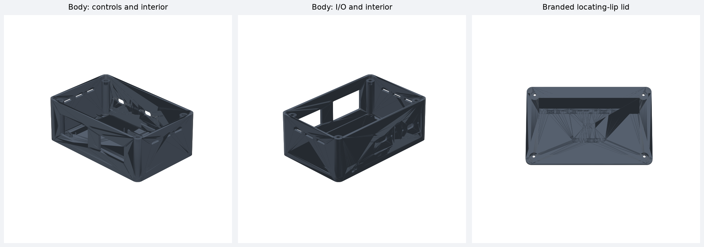

# Mission Communications Hub Mk I

**Branding:** Mission Communications Hub / Mk I / GAWG CAP

**Current mechanical revision:** R0.6

MissionComHub is an experimental portable power-interface enclosure for a Peplink MAX BR1 Pro 5G and Starlink Mini using an Anker SOLIX C200 DC or equivalent USB-C PD source. It is designed for temporary CAP aircraft, ground-vehicle, and mission-base use.

## R0.6 configuration

- 140 × 90 × 52 mm PETG-CF body
- Separate 4 mm serviceable lid with locating lip and raised branding
- Power switch opening: 38.55 × 20.77 mm
- Fit-tested voltmeter opening: 45.17 × 26.39 mm
- Two AAOTOKK USB-C panel-mount positions for battery input and Starlink output
- Fit-tested 4.10 × 2.40 mm bonded-cable exit for the Peplink lead
- Enlarged 4.55 × 2.70 mm strain-relief channel and two-screw clamp
- Internal Blue Sea Systems 5045 mounting bosses at 65.1 mm centers
- Internal PD-board cradles, cable-routing rails, and tie-down points
- Engraved `BATTERY`, `STARLINK`, and `PEPLINK` I/O labels

R0.6 preserves the physically verified control openings from R0.5, selects the smallest successful Peplink wire-coupon opening, and enlarges the strain-relief channel by 0.5 mm overall in both dimensions.

## Download and print

- Complete package: [`releases/R0.6/MissionComHub_MkI_Enclosure_R0.6.zip`](releases/R0.6/MissionComHub_MkI_Enclosure_R0.6.zip)
- 3MF files: [`CAD/3MF/R0.6`](CAD/3MF/R0.6)
- STL files: [`CAD/STL/R0.6`](CAD/STL/R0.6)
- STEP files: [`CAD/STEP/R0.6`](CAD/STEP/R0.6)
- Parametric CadQuery generator: [`CAD/CadQuery/make_mch_mk1_r06.py`](CAD/CadQuery/make_mch_mk1_r06.py)
- Dimensions and validation: [`CAD/Releases/R0.6`](CAD/Releases/R0.6)

Print the control, AAOTOKK USB-C, and wire-exit coupons before committing to the complete body.

## Suggested prototype settings

- Prusa CORE One
- PETG-CF with a hardened 0.4 mm nozzle
- 0.20 mm layer height
- 4 perimeters
- 5 top and bottom layers
- 25–35% gyroid infill

The branded lid needs slicer support beneath its center when printed branding-up. See the release README for orientation guidance.

## Validation status

Every R0.6 STL and 3MF is watertight with consistent winding. STEP files re-import as valid solids, STL and 3MF dimensions agree, the body envelope is exactly 140 × 90 × 52 mm, and assembled body/lid interference is 0 mm³.

## Repository layout

- `CAD/CadQuery/` — parametric source
- `CAD/3MF/`, `CAD/STL/`, `CAD/STEP/` — synchronized manufacturing exports
- `CAD/Releases/` — dimensions, checksums, and validation reports
- `docs/` — requirements, design specification, BOM, assembly, and tests
- `images/` — previews and future build photographs
- `releases/` — complete downloadable release archives
- `tools/` — validation and preview utilities

## Safety

This is experimental mission-support equipment, not certified avionics. It must not interfere with aircraft controls, emergency egress, required equipment, weight and balance, or approved aircraft systems. Electrical architecture, wire sizing, fuse selection, thermal performance, and flight restraint must be independently verified before operational use.

## License

Documentation and mechanical designs are released under CERN-OHL-P-2.0 unless a file states otherwise. Software uses the MIT License where applicable.
