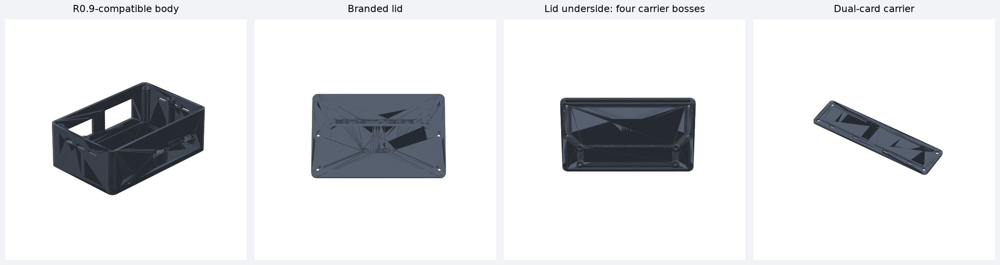

# Mission Communications Hub Mk I

**Branding:** Mission Communications Hub / Mk I / GAWG CAP

**Current mechanical revision:** R0.10 USB-PD carrier

MissionComHub is an experimental portable power-interface enclosure for a Peplink MAX BR1 Pro 5G and Starlink Mini using an Anker SOLIX C200 DC or equivalent USB-C PD source. It is designed for temporary CAP aircraft, ground-vehicle, and mission-base use.

## R0.10 configuration

- 146 × 96 × 52 mm PETG-CF body, minimally enlarged for both received power blocks
- Separate 4 mm serviceable lid with locating lip and raised branding
- Power switch opening: 38.55 × 20.77 mm
- Fit-tested voltmeter opening: 45.17 × 26.39 mm
- Two refactored USB-C panel positions for the received cable-backed fittings
- Confirmed 18.55 mm USB-C mounting centers
- 13.20 × 6.85 mm printed pass-throughs for the measured 12.70 × 6.35 mm bodies
- 25.80 × 8.02 mm rounded flange pockets for the measured 25.40 × 7.62 mm flanges
- Fit-tested 4.10 × 2.40 mm bonded-cable exit for the Peplink lead
- Enlarged 4.55 × 2.70 mm strain-relief channel and two-screw clamp
- Internal Blue Sea Systems 5045 mounting bosses at 65.1 mm centers
- Internal unfused-busbar bosses at the confirmed 120.65 mm (4.75 inch) centers
- A clear central cable channel with four tie-down points
- Correctly oriented exterior `BATTERY`, `STARLINK`, and `PEPLINK` I/O labels
- Exterior `VOLTAGE` and `POWER` control labels
- Blue Sea 5045 fused-block riser coupon
- Full-envelope unfused-busbar riser coupon with fixed 120.65 mm centers
- Final engraved USB-C coupon at 18.55 mm centers
- Revised lid with four blind M3 insert bosses
- Removable 114 × 30 mm carrier for two USB-PD cards
- Open-ended card guides and two zip ties per card
- Documented battery-input and Starlink-output card placement above the bus bar

R0.10 keeps the R0.9 body unchanged and adds a serviceable dual-card carrier under the lid. A body already printing from R0.9 remains compatible; only the R0.10 lid and carrier are needed for the new mounting system.

## Download and print

- Complete package: [`releases/R0.10/MissionComHub_MkI_Enclosure_R0.10.zip`](releases/R0.10/MissionComHub_MkI_Enclosure_R0.10.zip)
- 3MF files: [`CAD/3MF/R0.10`](CAD/3MF/R0.10)
- STL files: [`CAD/STL/R0.10`](CAD/STL/R0.10)
- STEP files: [`CAD/STEP/R0.10`](CAD/STEP/R0.10)
- Parametric CadQuery generator: [`CAD/CadQuery/make_mch_mk1_r10.py`](CAD/CadQuery/make_mch_mk1_r10.py)
- Dimensions, placement map, and validation: [`CAD/Releases/R0.10`](CAD/Releases/R0.10)

If the R0.9 body is already printing, keep it. Print the R0.10 lid and dual USB-PD card carrier.

## Suggested prototype settings

- Prusa CORE One
- PETG-CF with a hardened 0.4 mm nozzle
- 0.20 mm layer height
- 4 perimeters
- 5 top and bottom layers
- 25–35% gyroid infill

The branded lid needs slicer support beneath its center when printed branding-up. See the release README for orientation guidance.

## Validation status

Every R0.10 STL and 3MF is watertight with consistent winding. STEP files re-import as valid solids, STL and 3MF dimensions agree, body/lid interference is 0 mm³, and the installed carrier plus conservative 8 mm-deep card envelopes clear the body and both power blocks. The conservative vertical clearance above the bus-bar cover is 4.84 mm.

## Repository layout

- `CAD/CadQuery/` — parametric source
- `CAD/3MF/`, `CAD/STL/`, `CAD/STEP/` — synchronized manufacturing exports
- `CAD/Releases/` — dimensions, checksums, and validation reports
- `docs/` — requirements, design specification, BOM, assembly, and tests
- `images/` — previews and future build photographs
- `releases/` — complete downloadable release archives
- `tools/` — validation and preview utilities

## Safety

This is experimental mission-support equipment, not certified avionics. It must not interfere with aircraft controls, emergency egress, required equipment, weight and balance, or approved aircraft systems. Electrical architecture, wire sizing, fuse selection, thermal performance, and flight restraint must be independently verified before operational use.

## License

Documentation and mechanical designs are released under CERN-OHL-P-2.0 unless a file states otherwise. Software uses the MIT License where applicable.
